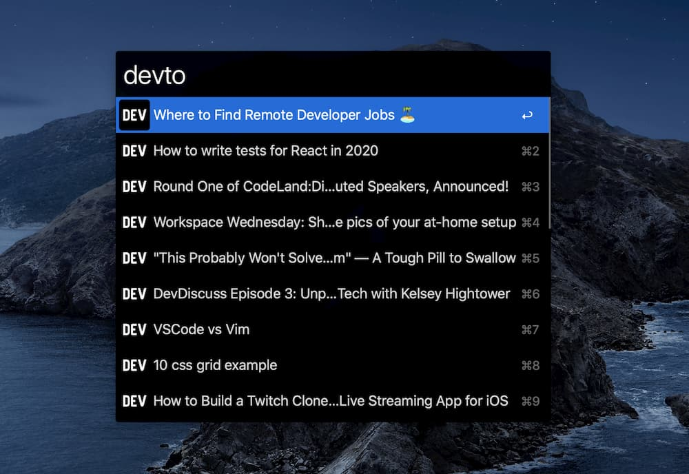

# DEV.to for alfred

This workflow retrieve the top 10 articles from [dev.to](https://dev.to), was made as part of my [#100DaysOfCode](https://mijailr.com/days_of_code/), because I use [Alfred](https://www.alfredapp.com/) workflows a lot to simplify tedious processes and because I like to read articles from dev.to.

## TODO

- [ ] Add tests
- [ ] Add Github Actions to publish new versions
- [ ] Add search feature

## Contributing

All the contributions are welcome, feel free to fork or create a pull request.

## Sponsorship

Do you want to sponsor? [mijailr](https://github.com/sponsors/mijailr)

